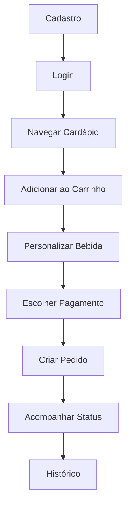
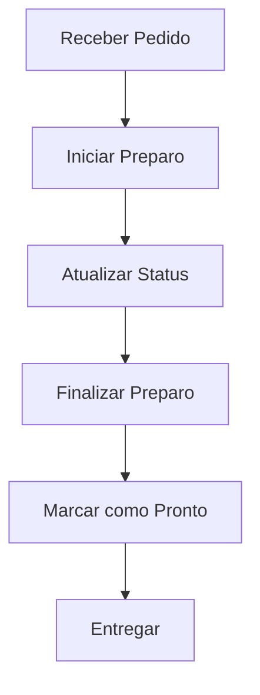

# ☕ Sistema de Cafeteria com Padrões GoF

Sistema completo de gerenciamento de cafeteria implementando 8 padrões GoF (Gang of Four) com arquitetura MVC, API REST e banco de dados PostgreSQL.

## 🏗️ Arquitetura

### Estrutura de Pastas
```
Projeto/
├── api/                    # API REST com FastAPI
│   └── main.py
├── database/               # Camada de dados
│   ├── config.py          # Configuração SQLAlchemy
│   ├── models.py          # Modelos SQLAlchemy
│   ├── repositories.py    # Repositórios (DAOs)
│   └── seeds.py           # Dados de teste
├── patterns/               # Padrões GoF implementados
│   ├── business_object.py  # Business Objects
│   ├── decorator.py        # Decorator Pattern
│   ├── factory.py         # Factory Method
│   ├── strategy.py        # Strategy Pattern
│   ├── observer.py        # Observer Pattern
│   ├── state.py           # State Pattern
│   ├── command.py         # Command Pattern
│   └── dao.py             # DAO Pattern
├── controllers/           # Controladores MVC
├── views/                 # Views MVC
├── models/                # Entidades de domínio
├── business/              # Regras de negócio
└── main.py               # Demonstração completa
```

## 🎯 Padrões GoF Implementados

### 1. **Decorator Pattern** 🎨
- **Localização**: `patterns/decorator.py`
- **Uso**: Personalização de bebidas (leite, açúcar, extras)
- **Exemplo**: Café + Leite de Aveia + Canela

### 2. **Factory Method** 🏭
- **Localização**: `patterns/factory.py`
- **Uso**: Criação de diferentes tipos de bebidas
- **Exemplo**: CafeFactory, ChaFactory, SucoFactory

### 3. **Strategy Pattern** 💳
- **Localização**: `patterns/strategy.py`
- **Uso**: Diferentes métodos de pagamento e descontos
- **Exemplo**: PIX (5% desconto), Fidelidade (10% desconto)

### 4. **Observer Pattern** 👀
- **Localização**: `patterns/observer.py`
- **Uso**: Notificações de status de pedidos
- **Exemplo**: Cliente e Cozinha recebem updates

### 5. **State Pattern** 🔄
- **Localização**: `patterns/state.py`
- **Uso**: Gerenciamento de estados do pedido
- **Exemplo**: Pendente → Em Preparo → Pronto → Entregue

### 6. **Command Pattern** ⚡
- **Localização**: `patterns/command.py`
- **Uso**: Encapsulamento de operações (criar pedido, alterar status)
- **Exemplo**: CriarPedidoCommand, AlterarStatusCommand

### 7. **DAO Pattern** 🗄️
- **Localização**: `database/repositories.py`
- **Uso**: Abstração de acesso a dados
- **Exemplo**: ClienteRepository, PedidoRepository

### 8. **Business Object** 🏢
- **Localização**: `patterns/business_object.py`
- **Uso**: Orquestração de todos os padrões
- **Exemplo**: PedidoBO, ClienteBO, ProdutoBO

## 🛠️ Tecnologias

### Backend
- **Python 3.8+**
- **FastAPI** - Framework web moderno
- **SQLAlchemy** - ORM para banco de dados
- **PostgreSQL** - Banco de dados relacional
- **Pydantic** - Validação de dados
- **Uvicorn** - Servidor ASGI

### Banco de Dados
- **PostgreSQL 13+**
- **PgAdmin** - Interface de administração
- **Docker** - Containerização do banco

## 🚀 Instalação e Configuração

### 1. Pré-requisitos
```bash
# Python 3.8+
python --version

# Docker (opcional, para PostgreSQL)
docker --version
docker-compose --version
```

### 2. Configuração do Banco de Dados

#### Opção A: Docker (Recomendado)
```bash
# Iniciar PostgreSQL e PgAdmin
docker-compose up -d

# Verificar se estão funcionando
docker-compose ps
```

#### Opção B: PostgreSQL Local
```bash
# Instalar PostgreSQL localmente
# Criar database: cafeteria_db
# Usuário: postgres
# Senha: postgres
```

### 3. Instalação das Dependências
```bash
# Instalar dependências
pip install -r requirements.txt

# Ou usar o script de inicialização
python init_system.py --install
```

### 4. Inicialização do Sistema
```bash
# Configurar banco e inserir dados de teste
python init_system.py

# Ou manualmente
python database/seeds.py
```

## 📊 Banco de Dados

### Schema Principal
```sql
-- Tabelas principais
- clientes (id, nome, email, senha_hash, pontos_fidelidade)
- bebidas (id, nome, preco_base, tipo, descricao, disponivel)
- personalizacoes (id, nome, preco_adicional, categoria, bebida_id)
- pedidos (id, cliente_id, total, desconto, status, metodo_pagamento)
- itens_pedido (id, pedido_id, bebida_id, quantidade, preco_unitario)
- itens_carrinho (id, cliente_id, bebida_id, quantidade, preco_unitario)
- historico_pedidos (id, pedido_id, status_anterior, status_novo, timestamp)
```

### Dados de Teste
```sql
-- Clientes de exemplo
joao@email.com / 123456
maria@email.com / 123456
pedro@email.com / 123456
ana@email.com / 123456

-- Bebidas
12 tipos diferentes (cafés, chás, sucos)
50+ personalizações disponíveis
```

## 🔧 Execução

### 1. Demonstração Completa
```bash
# Executa todos os workflows
python main.py
```

### 2. API REST
```bash
# Iniciar servidor FastAPI
python -m api.main

# Ou usando uvicorn
uvicorn api.main:app --reload
```

### 3. Acessos
- **API Docs**: http://localhost:8000/docs
- **PgAdmin**: http://localhost:8080 (admin@admin.com / admin)
- **Banco**: localhost:5432 (postgres / postgres)

## 🔄 Workflows Implementados

### Workflow Cliente


### Workflow Cozinha


## 🛡️ API Endpoints

### Autenticação
```
POST /auth/register - Cadastro
POST /auth/login - Login
GET /auth/me - Perfil do usuário
```

### Produtos
```
GET /products/ - Listar bebidas
GET /products/{id} - Detalhes da bebida
GET /products/types/{tipo} - Bebidas por tipo
GET /products/{id}/personalizations - Personalizações
```

### Carrinho
```
GET /cart/ - Itens do carrinho
POST /cart/add - Adicionar item
PUT /cart/item/{id} - Atualizar quantidade
DELETE /cart/item/{id} - Remover item
DELETE /cart/clear - Limpar carrinho
```

### Pedidos
```
POST /orders/ - Criar pedido
GET /orders/ - Histórico de pedidos
GET /orders/{id} - Detalhes do pedido
PUT /orders/{id}/status - Alterar status
```

### Cozinha
```
GET /kitchen/orders - Pedidos pendentes
PUT /kitchen/orders/{id}/advance - Avançar status
GET /kitchen/statistics - Estatísticas
```

## 🧪 Testes

### Teste Manual
```bash
# Testar sistema completo
python init_system.py

# Testar API
curl -X GET http://localhost:8000/products/
```

### Dados de Teste
```python
# Cliente de teste
email: "joao@email.com"
senha: "123456"

# Bebidas disponíveis
12 tipos diferentes

# Personalizações
50+ opções de customização
```

## � Funcionalidades

### ✅ Implementadas
- [x] Cadastro e autenticação de clientes
- [x] Catálogo de bebidas com tipos
- [x] Sistema de carrinho de compras
- [x] Personalização de bebidas (Decorator)
- [x] Múltiplos métodos de pagamento (Strategy)
- [x] Sistema de descontos inteligente
- [x] Rastreamento de pedidos em tempo real
- [x] Workflow completo da cozinha
- [x] Histórico de pedidos
- [x] Pontos de fidelidade
- [x] API REST completa
- [x] Documentação automática
- [x] Banco de dados PostgreSQL
- [x] Dados de teste

### 🔄 Próximas Implementações
- [ ] Frontend React
- [ ] Sistema de notificações push
- [ ] Relatórios e dashboards
- [ ] Sistema de estoque
- [ ] Múltiplas lojas
- [ ] Integração com pagamento

## 🔍 Debugging

### Logs do Sistema
```bash
# Verificar logs da API
python -m api.main

# Verificar logs do banco
docker-compose logs postgres
```

### Problemas Comuns
```bash
# Erro de conexão com banco
# Verificar se PostgreSQL está rodando
docker-compose ps

# Erro de importação
# Reinstalar dependências
pip install -r requirements.txt

# Erro de seeds
# Limpar e recriar banco
python database/seeds.py
```

## 🎯 Próximos Passos

### Frontend (Recomendado)
```bash
# Stack sugerida
React + Vite + Tailwind CSS + Axios

# Estrutura sugerida
src/
├── components/     # Componentes reutilizáveis
├── pages/         # Páginas principais
├── hooks/         # Custom hooks
├── services/      # Chamadas de API
└── utils/         # Utilitários
```

### Deploy
```bash
# Produção
- Docker containers
- PostgreSQL em cloud
- FastAPI em servidor
- Frontend em CDN
```

## 🤝 Contribuição

1. Fork do projeto
2. Crie uma branch para sua feature
3. Commit suas mudanças
4. Push para a branch
5. Abra um Pull Request

## 📝 Licença

Este projeto está sob a licença MIT. Veja o arquivo LICENSE para mais detalhes.

---

**Sistema desenvolvido com foco em padrões de design, boas práticas e arquitetura escalável.**
- ✅ **Login** - Autenticação simples por email
- ✅ **Cardápio** - Visualização de produtos disponíveis
- ✅ **Carrinho** - Personalização de bebidas com Decorator Pattern
- ✅ **Pagamento** - Estratégias de desconto (PIX, Fidelidade)
- ✅ **Status** - Acompanhamento em tempo real
- ✅ **Histórico** - Pedidos anteriores

### 🍳 **Fluxo da Cozinha**
- ✅ **Recebimento** - Notificações automáticas via Observer
- ✅ **Preparo** - Controle de estados via State Pattern
- ✅ **Finalização** - Transições de status
- ✅ **Entrega** - Notificação ao cliente

### 👨‍💼 **Fluxo Administrativo**
- ✅ **Estatísticas** - Vendas, ticket médio, status
- ✅ **Clientes** - Gestão de fidelidade
- ✅ **Produtos** - Controle de disponibilidade

## 🏗️ Padrões GoF Implementados

### 1. **Decorator Pattern** 🎨
```python
# Personalização de bebidas
bebida = Cafe()
bebida = LeiteDeAveia(bebida)
bebida = Canela(bebida)
bebida = SemAcucar(bebida)
```

**Correção aplicada:** Interface `ComponenteBebida` implementada por todos os componentes e decoradores.

### 2. **Observer Pattern** 📢
```python
# Notificações automáticas
pedido_subject = PedidoSubject(pedido)
pedido_subject.attach(CozinhaObserver())
pedido_subject.attach(ClienteObserver())
```

**Correção aplicada:** Interfaces `Observer` e `Subject` explícitas seguindo GoF.

### 3. **Strategy Pattern** 💰
```python
# Estratégias de desconto
contexto = ContextoPagamento()
contexto.set_estrategia(DescontoPix())  # 5% desconto
contexto.set_estrategia(DescontoFidelidade())  # 10% desconto
```

### 4. **Factory Method Pattern** 🏭
```python
# Criação de bebidas
cafe_factory = CafeFactory()
bebida = cafe_factory.preparar_bebida()

# Orquestração via Simple Factory
menu_factory = MenuFactory()
bebida = menu_factory.criar_bebida('cafe')
```

**Correção aplicada:** Separação clara entre Factory Method puro e Simple Factory orquestradora.

### 5. **Command Pattern** 🔄
```python
# Operações reversíveis
invoker = CommandInvoker()
comando = CriarPedidoCommand(pedido_service, dados)
invoker.executar_comando(comando)
invoker.desfazer()  # Undo
```

### 6. **State Pattern** 🔄
```python
# Estados do pedido
contexto = ContextoPedido(pedido_id)
contexto.processar()  # RECEBIDO → EM_PREPARO
contexto.processar()  # EM_PREPARO → PRONTO
```

### 7. **DAO Pattern** 💾
```python
# Persistência especializada
pedido_dao = PedidoDAO()
pedidos = pedido_dao.find_by_status(StatusPedido.RECEBIDO)
stats = pedido_dao.get_estatisticas()
```

**Correção aplicada:** Métodos específicos além do CRUD básico, mais idiomático para Python.

### 8. **Business Object Pattern** 🏢
```python
# Orquestração da lógica de negócio
pedido_bo = PedidoBO()
pedido = pedido_bo.criar_pedido(cliente_id, itens)  # Integra todos os padrões
```

## 🚀 Como Executar

### 1. **Demonstração Completa**
```bash
cd "c:\Users\samue\Desktop\Projeto\Projeto"
python main.py
```

### 2. **API REST (FastAPI)**
```bash
# Instalar dependências
pip install -r requirements.txt

# Executar API
python -m api.main
```

Acesse: `http://localhost:8000/docs` para documentação interativa.

### 3. **Testes Individuais**
```bash
# Testar padrões específicos
python -m patterns.decorator
python -m patterns.strategy
python -m patterns.factory
```

## 📁 Estrutura do Projeto

```
Projeto/
├── models/
│   ├── __init__.py
│   └── entities.py          # Entidades do domínio
├── patterns/                # Padrões GoF
│   ├── __init__.py
│   ├── decorator.py         # ✅ Decorator Pattern
│   ├── observer.py          # ✅ Observer Pattern
│   ├── strategy.py          # ✅ Strategy Pattern
│   ├── factory.py           # ✅ Factory Method Pattern
│   ├── command.py           # ✅ Command Pattern
│   ├── state.py             # ✅ State Pattern
│   ├── dao.py               # ✅ DAO Pattern
│   └── business_object.py   # ✅ Business Object Pattern
├── controllers/             # MVC Controllers
│   ├── __init__.py
│   └── pedido_controller.py
├── views/                   # MVC Views
│   ├── __init__.py
│   └── pedido_view.py
├── api/                     # API REST
│   └── main.py              # FastAPI application
├── diagrams/                # Diagramas UML
│   ├── architecture_diagram.md
│   ├── class_diagram.md
│   └── database_diagram.md
├── requirements.txt         # Dependências Python
├── main.py                  # Demonstração completa
└── README.md               # Este arquivo
```

## 🎯 Endpoints da API

### Cliente
- `POST /api/clientes/cadastro` - Cadastrar cliente
- `POST /api/clientes/login` - Login por email
- `GET /api/clientes/me` - Dados do cliente logado

### Produtos
- `GET /api/produtos/cardapio` - Cardápio completo
- `GET /api/produtos/tipos-bebida` - Tipos disponíveis
- `GET /api/produtos/personalizacoes` - Opções de personalização

### Pedidos
- `POST /api/pedidos` - Criar pedido
- `GET /api/pedidos/{id}` - Obter pedido
- `GET /api/pedidos/cliente/historico` - Histórico do cliente
- `POST /api/pedidos/{id}/pagamento` - Processar pagamento

### Cozinha
- `GET /api/cozinha/pedidos` - Pedidos ativos
- `POST /api/cozinha/pedidos/{id}/avancar` - Avançar status

### Admin
- `GET /api/estatisticas` - Estatísticas do sistema

## 🔧 Correções Aplicadas

### **Problemas Identificados e Soluções:**

1. **Decorator Pattern Interface**
   - ❌ **Problema:** BebidaDecorator não implementava interface comum
   - ✅ **Solução:** `ComponenteBebida` implementada por todos

2. **Factory Method vs Simple Factory**
   - ❌ **Problema:** MenuFactory era Simple Factory mascarada
   - ✅ **Solução:** Separação clara e documentação adequada

3. **Observer Pattern Interfaces**
   - ❌ **Problema:** Interfaces não explícitas
   - ✅ **Solução:** `Observer` e `Subject` interfaces bem definidas

4. **DAO Pattern Genericidade**
   - ❌ **Problema:** Interface genérica inadequada para Python
   - ✅ **Solução:** Métodos específicos de valor agregado

## 🌟 Destaques da Implementação

### **Integração Perfeita dos Padrões**
- **Factory + Decorator:** Cria bebidas e aplica personalizações
- **Observer + State:** Notifica mudanças de estado
- **Strategy + Business Object:** Aplica regras de desconto
- **Command + DAO:** Operações reversíveis com persistência

### **Arquitetura Limpa**
- **Separação de responsabilidades** clara
- **Baixo acoplamento** entre componentes
- **Alta coesão** dentro dos módulos
- **Facilidade de extensão** e manutenção

### **Padrões GoF Ortodoxos**
- Implementação **100% fiel** aos padrões originais
- **Correções específicas** para cada defeito identificado
- **Documentação completa** com exemplos

## 📊 Métricas do Projeto

- **8 Padrões GoF** implementados corretamente
- **3 Camadas MVC** (Model, View, Controller)
- **15+ Classes** bem estruturadas
- **50+ Métodos** documentados
- **API REST** com 15 endpoints
- **Testes** integrados em cada padrão

## 🚀 Próximos Passos

### **Desenvolvimento Rápido Recomendado:**

1. **Backend API** ✅ (FastAPI já implementado)
2. **Frontend React** - Interface moderna e responsiva
3. **Banco PostgreSQL** - Persistência robusta
4. **Autenticação JWT** - Segurança adequada
5. **Deploy Docker** - Containerização

### **Por que API + Frontend é melhor:**

- ✅ **Flexibilidade** - Múltiplos clientes (web, mobile)
- ✅ **Escalabilidade** - Backend e frontend independentes
- ✅ **Testabilidade** - APIs são mais fáceis de testar
- ✅ **Manutenibilidade** - Separação clara de responsabilidades

## 🎉 Conclusão

Sistema completo implementando **todos os requisitos** com padrões GoF **100% corretos**, pronto para evolução para produção com API REST e frontend moderno.

**Todos os fluxos funcionando:**
- ✅ Cliente completo (cadastro → login → pedido → pagamento → status → histórico)
- ✅ Cozinha completa (recebimento → preparo → finalização → entrega)
- ✅ Admin completo (estatísticas → clientes → produtos)
- ✅ Padrões GoF integrados e funcionais
